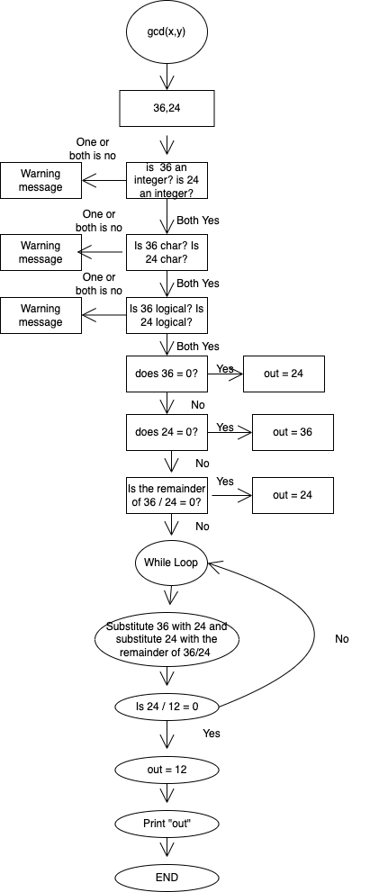

```{r setup, include=FALSE}
knitr::opts_chunk$set(echo = TRUE)
```


# Sourcing the Functions

```{r}
source("205615894_stats102a_hw1.R")
```

# Greatest Common Divisor (GCD) and Least Common Multiple (LCM)

Please write a function, `gcd()`, which takes two arguments $x$, $y$ and calculates their greatest common divisor (GCD) using the Euclidean algorithm.

The Euclidean Algorithm Example: Let $a$ = 180 and $b$ = 25

1. calculate 180/25, and get the result 7 with remainder 5, so 180 = 7 $\times$ 25 + 5.
2. calculate 25/5, and get the result 5 with remainder 0, so 25 = 5 $\times$ 5 + 0.
3. the greatest common divisor of 180 and 25 is 5.

Make use of `gcd()` to write a function, `lcm()`, which takes a vector and find the least common multiple. The length of the vector will be at least two but no more than 100.

## Algorithm/Flowchart

```{r, fig.cap="General stucture of a flowchart.", out.width="50%", out.height="50%", fig.pos="H", fig.align='center'}

knitr::include_graphics("flowchart_lcm.png")
```


## Test Cases

Once the functions are written, change the option `eval=F` to `eval=T`.

```{r, eval=T}
gcd(72, 8) # result = 8
gcd(-1, 531) # result = 1
gcd(47011, 73618) # result = 1
lcm(c(12, 21)) # result = 84
lcm(c(4789, 6123, 199)) # result = 5835286353
```

# Prime Factorization

Please write a function `get_factors()` which takes a number $x$ and returns a list object. The list object should contain the vector of unique prime factors of $x$ and the corresponding exponents. In addition, write one “helper function” `is_prime()` that returns a logical vector depending on whether or not the elements in $x$ are prime.

A good way to test this function should be:

```
x <- sample(x = 1e4, size = 1)
y <- get_factors(x)
this_works <- (prod(y$primes ^ y$exponents) == x) & all(is_prime(y$primes))
```

It is a necessary, but not sufficient, condition that `this_works == TRUE` for your function to work as intended. (It will largely depend on if your `is_prime()` function is correct.)

## Algorithm/Flowchart

```{r, fig.cap="General stucture of a flowchart.", out.width="50%", out.height="50%", fig.pos="H", fig.align='center'}
knitr::include_graphics("flowchart_is_prime.png")
knitr::include_graphics("flowchart_get_factors.png")
```


## Test Cases

Once the functions are written, change the option `eval=F` to `eval=T`. 

```{r, eval=T}
is_prime(c(9, 7, 1)) # result = [False True False]
get_factors(1920) # results = list(primes = [2 3 5], exponents = [7 1 1])
get_factors(7)
get_factors(1)

x <- sample(x = 1e4, size = 1)
y <- get_factors(x)
this_works <- prod(y$primes^y$exponents) == x & all(is_prime(y$primes))
this_works
```

